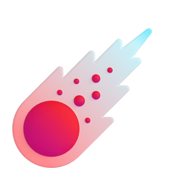

<!-- GIF HEADER -->


<p align="center"><picture align="center"></picture></p>
<h3 align="center"> </h3>

<a href="https://github.com/MultiBot-OFC"><a>

####  Holaa 👋🏻, bienvenido a mi perfil
espero que tengas un exelente dia. 


<div align="center">
<a href="https://github.com/MultiBot-OFC/MultiBot-OFC"></a> 

<p align='center'>
<a href="https://www.paypal.me/ColaboracionBotOFC"></a>
<a href="https://wa.me/5493873232212"></a>
<a href="https://t.me/ExoticoBot_OFC"></a>
<a href="https://www.atom.bio/exotico-ofc/"></a>
<a href="mailto:guardianbotmdoficial@gmail.com"></a>
<p align="center">
<a href="#"></a> 
<a href="https://chat.whatsapp.com/DHEbIozmsHVGBI5oOb0XDB" target="white"></a>
<a href="https://chat.whatsapp.com/GHMU94F45nW1RyRcXifiQb" target="blank"></a>
<p/>
<p align="center">
<a href="https://github.com/MultiBot-OFC"></a> 
<a href="https://whatsapp.com/channel/0029Vaf8ZxlLdQelKKUUON22" target="white"></a>
<p align="center">
<p/>
<a href="https://github.com/MultiBot-OFC"></a>
</p>

<a href="https://wa.me/5493873232221" target="white"></a>
<a href="https://wa.me/5491133980551" target="white"></a>

<div align="center">


<!-- GIF HEADER -->


<p align="center"><picture align="center"></picture></p>

<h2 align="center">👑 𝐌𝐈 𝐏𝐄𝐑𝐅𝐈𝐋 👑</h2>


[](https://git.io/typing-svg)

[](https://postimg.cc/Jsh8ND6Y)

<!-- RAINBOW LINE BOT -->


<a href="https://github.com/Bots-WhatsApp-OFC/Bots-WhatsApp-OFC" target="_blank">
  
</a>

<a href="https://github.com/Bots-WhatsApp-OFC/Bots-WhatsApp-OFC/blob/main/README-en-br.md" target="_blank">
  
</a>

<a href="https://github.com/Bots-WhatsApp-OFC/Bots-WhatsApp-OFC/blob/main/README-pt-br.md" target="_blank">
  
</a>

`Multi Lenguaje: Repo-Beta 1.3.0`

## 🤖 INSTALAR POR CODE SPACE 🤖
[Clik Aqui](https://github.com/codespaces/new?skip_quickstart=true&machine=basicLinux32gb&repo=755739704&ref=main&geo=UsEast)

<!-- RAINBOW LINE BOT -->


[](https://github.com/ashutosh00710/github-readme-activity-graph)


[](https://github.com/Bots-WhatsApp-OFC)
 

<!-- RAINBOW LINE BOT -->


<h3 align="center"> 𝐈𝐍𝐅𝐎𝐑𝐌𝐀𝐂𝐈𝐎𝐍 𝐌𝐈𝐀 </h3>
<p align="center">


-  Estudiante de programación.
  
-  Trabajo en linea.
  
-  Diseño por aplicaciones.
  
-  Colaborar en un proyecto.
  
-  Mas trabajado: github

<!-- RAINBOW LINE BOT -->


<h3 align="center"> 𝐌𝐈𝐒 𝐏𝐑𝐎𝐘𝐄𝐂𝐓𝐎𝐒 </h3>
<p align="center">

<a href="https://github.com/Bots-WhatsApp-OFC/Github-Emoji"></a>
<a href="https://github.com/Bots-WhatsApp-OFC/Personalizado-readme"></a>
<a href="https://github.com/Bots-WhatsApp-OFC/Github-Emoji-T"></a>
<a href="https://github.com/Bots-WhatsApp-OFC/SharkBot-Beta"></a>

<!-- RAINBOW LINE BOT -->


<h3 align="center"> 𝐂𝐇𝐀𝐓 𝐆𝐏𝐓 / 𝐎𝐍 </h3>
<p align="center">

> [!NOTE]
> Tambien si te interesa, puedes entrar en estos repositorios en donde encontraras dos bots mas por instalar.


<!-- RAINBOW LINE BOT -->


<h2> Lenguajes de programación  </h2>
<a href= https://github.com/Aditya664?tab=repositories&q=&type=&language=python&sort= >  </a>
<a href= https://github.com/Aditya664?tab=repositories&q=&type=&language=reactjs&sort= >  </a>
<a href= https://github.com/Aditya664?tab=repositories&q=&type=&language=javascript&sort= >  </a>
<a href= https://github.com/Aditya664?tab=repositories&q=&type=&language=scikit&sort= >  </a>
<a href= https://github.com/Aditya664?tab=repositories&q=&type=&language=c&sort= >  </a>
<a href= https://github.com/Aditya664?tab=repositories&q=&type=&language=cpp&sort= >  </a>
<a href= https://github.com/Aditya664?tab=repositories&q=&type=&language=sqlite&sort= >  </a>
<a href= https://github.com/Aditya664?tab=repositories&q=&type=&language=pytorch&sort= >  </a>
<a href= https://github.com/Aditya664?tab=repositories&q=&type=&language=css&sort= >  </a>
<a href= https://github.com/Aditya664?tab=repositories&q=&type=&language=html&sort= >  </a>
<a href= https://github.com/Aditya664?tab=repositories&q=&type=&language=android&sort= >  </a>
<a href= https://github.com/Aditya664?tab=repositories&q=&type=&language=csharp&sort= >  </a>

<!-- RAINBOW LINE BOT -->


[](https://postimg.cc/4YzB8BYW)

##  INSTALAR EL BOT

---------
 <details> 
   <summary>✅ 𝐇𝐀𝐆𝐀 𝐂𝐋𝐈𝐂𝐊 𝐀𝐐𝐔𝐈 ✅</summary>

##  NaufraZapp-MD
[](https://postimg.cc/3WcbxVMM)
<a href="https://github.com/Bots-WhatsApp-OFC/NaufraZapp-MD"></a>
<a href="https://github.com/Bots-WhatsApp-OFC/NaufraZapp-MD/graphs/contributors">
 
</a>
<details>
<summary><b> Clik para los comandos de instalacion </b></summary>

```bash
cd && termux-setup-storage
```

```bash
apt-get update -y && apt-get upgrade -y
```

```bash
pkg install -y git nodejs ffmpeg imagemagick && pkg install yarn 
```

```bash
git clone https://github.com/MultiBot-OFC/MultiBot-OFC.git && cd MultiBot-OFC
```

```bash
yarn install
```

```bash
npm install
```

```bash
npm update
```

```bash
npm start
```
</details>
 • ┄ • ┄ • ┄ • ┄ • ┄ • ┄ • ┄ • ┄ •
</details>


<!-- VISTAS DEL PERFIL -->
<p align="left">  </p>

<!-- TROFEOS GITHUB -->
<p align="left"> <a href="https://github.com/ryo-ma/github-profile-trophy"></a> </p>

<!-- RAINBOW LINE BOT -->


###  Contactanos si tienes dudas
 
<h2 align="center"> 𝐂𝐔𝐄𝐍𝐓𝐀𝐒 𝐎𝐅𝐈𝐂𝐈𝐀𝐋𝐄𝐒 </h2>


[](https://postimg.cc/JsB9RNGX)

 `WhatsApp para contactar`

[](https://wa.me/5493873687620) 

[](https://wa.me/19145948340) 

[](https://wa.me/51977272240) 

[](https://wa.me/51947454367) 

[](https://wa.me/5491130288378) 

[](https://wa.me/5491124919007) 

[](https://wa.me/5493873452653) 

<!-- RAINBOW LINE BOT -->


 `Soporte de bots / Telegram`

 [](https://t.me/Asistencia_Bot_WhatsApp_Telegram)

<!-- RAINBOW LINE BOT -->


 ¿Quieres poner emojis en movimiento en el diseño de tu proyecto? haga click abajo 

 <a href="https://github.com/Bots-WhatsApp-OFC/Github-Emoji" target="_blank">
  
</a> 

> [!IMPORTANT]
> Si no sabes cómo agregar emojis a tu github, te enseño como, haciendo click en mi [numero](https://wa.me/5493873687620) para darte opciones y formas de decorar tu github 

 `Paypal para donar` 

[](https://www.paypal.me/ColaboracionBotOFC)

<!-- RAINBOW LINE BOT -->


## 😃 Inversiones `Solo argentina` 😃
# invertir 25.000 / ganancia 85.000
# invertir 50.000 / ganancia 100.000
# invertir 80.000 / ganancia 150.000
# invertir 100.000 / ganancia 300.000
> No te quedes ahi, deja tu vida atras y invierte, te ofrezco buena suerte, invierte y gana 🥳

# Contactame
[](https://wa.me/5493873687620) 
<!-- RAINBOW LINE BOT -->


REQUISITOS PARA CONTRATARME

 Puedes darme una de cualquiera de estas cosas si tienes, asi te ayudare.

 Regalar `un numero virtual` por un bot editado, `dos por un bot creado.`

 Regalar `un numero oficial` por un bot editado, `dos por un bot creado.`

 Donar `5$ en PayPal` por un bot editado.

 Donar `10$ en PayPal` por un bot creado.

 Un `Token GuardianBot-MD`

 Quieres que colabore en tu proyecto? Puedes darme una de esas cosas mensionadas anteriormente.

<!-- RAINBOW LINE BOT -->


<details> 
<summary> VER COLABORADORES </summary>


 `Rodrigo_Official`

 `Amy-OfC`

 `Fernando_423`

 `Español-X-Ingles`

 `FantasyMan`

 `Sandra-Lola`

 `Luisito 343_Osito`

 `Daniel&`

 `Faku_242_Woli`

 `Lalo-LoCo`

 `The-Far/Zante`

</details>
<!-- RAINBOW LINE BOT -->


<a href="https://github.com/Bots-WhatsApp-OFC" target="_blank">
  
</a>

<div align="center">
  <h1 align="center">  DUEÑO DE LA CUENTA  </h1>

<a href="https://github.com/Bots-WhatsApp-OFC"></a>

 `Seguimiento / Bots-WhatsApp-OFC` 

 
</a>

<!-- GIF FOOTER -->


---------
